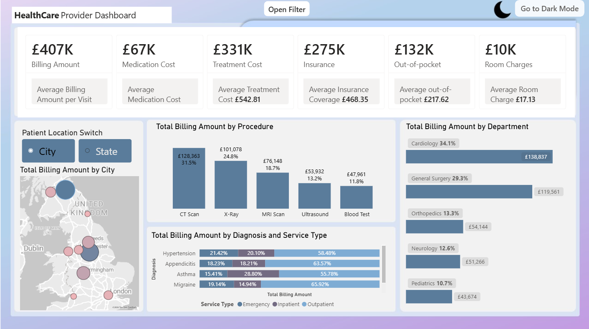
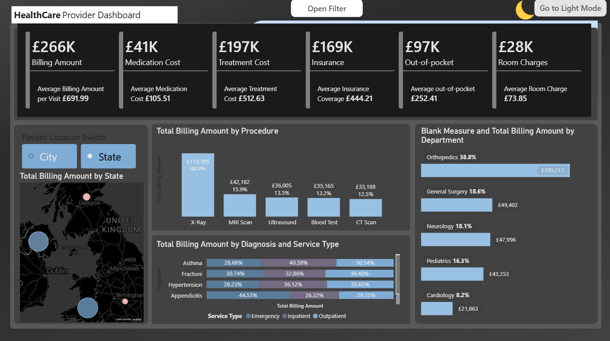
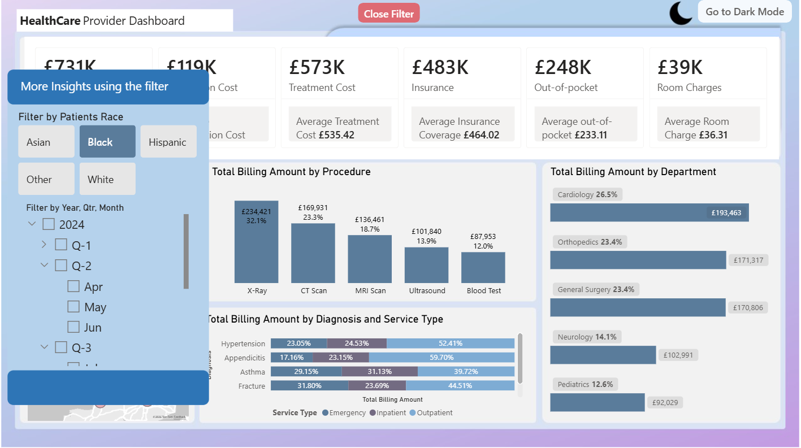

<h1 align="center">Healthcare Provider Billing Dashboard</h1>

  

## Business Problem

Healthcare providers need a clear view of where billing revenue comes from and how costs are split between insurance and patients. This dashboard analyses billing by procedure, department, diagnosis, service type and location to help identify the biggest cost drivers.

## Live Dashboard

[View the interactive dashboard](https://app.powerbi.com/view?r=eyJrIjoiNzk1ZDVmMTgtYjQxMy00ZjM1LWE3OWEtMjk0MDRlMDdjNzUwIiwidCI6ImY2ZjNmNzM3LTc4NmMtNDY2NS05MjM0LTFjZTA3Y2M5OTU1ZiIsImMiOjh9)

## Dashboard Views

**Dark Mode**

**Filter Panel**

## Data & Tools

- **Tool**: Power BI
- **Dataset**: add the name and source here
- **Features**: KPI cards, city and state map switch, filter panel, dark mode toggle

## Key Insights

- Total billing was £407K, made up of £331K in treatment cost, £67K in medication cost and £10K in room charges.
- Insurance covered £275K, and patients paid £132K out of pocket.
- Cardiology (34.1%) and General Surgery (29.3%) together account for over 60% of billing.
- CT Scan (31.5%) and X-Ray (24.8%) are the highest-billing procedures.
- Outpatient visits make up the largest share of billing across the diagnoses shown, including Hypertension, Appendicitis, Asthma and Migraine.
